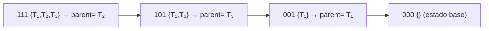

# Solución Dinamica para Riego Óptimo de Tablones

### Caracterizando la estructura de una solución óptima

El **Problema de Riego Óptimo** busca determinar el orden en que deben regarse los tablones de una finca con el propósito de **minimizar el costo total de penalización** ocasionado por los retrasos en el riego.  
Cada tablón $T_i$ se caracteriza mediante tres parámetros fundamentales:

- $ts_i$: tiempo máximo que el tablón puede permanecer sin recibir riego sin incurrir en penalización,
- $tr_i$: tiempo necesario para completar el riego del tablón,
- $p_i$: prioridad o factor de penalización asociado al retraso del tablón.

El objetivo consiste en encontrar una secuencia de riego $\pi = [T_{p 1}, T_{p 2}, \dots, T_{p n}]$ que minimice el costo total dado por:

$$
C(\pi) = \sum_{i=1}^{n} p_{i} \cdot \max(0,\, t_{fin}(\pi_i) - ts_{p i})
$$

donde $t_{fin}(\pi_i)$ representa el instante de finalización del riego del tablón $T_{\pi_i}$ dentro de la secuencia $\pi$, y se calcula como:

$$
t_{fin}(\pi_i) = \sum_{k=1}^{i} tr_{\pi_k}
$$

El problema pertenece a la categoría de **problemas combinatorios de optimización secuencial**, ya que el costo total depende no solo de los parámetros individuales de cada tablón, sino también del **orden en que se riegan**.  
El espacio de búsqueda tiene un crecimiento factorial ($n!$), lo que hace inviable la resolución mediante fuerza bruta para valores moderados de $n$.

Para abordar esta dificultad, se aplica una estrategia de **Programación Dinámica**, que permite dividir el problema en subproblemas solapados, almacenando los resultados parciales para evitar cálculos repetidos.  
La representación de los estados mediante **máscaras de bits** ($S$) posibilita codificar de forma eficiente los subconjuntos de tablones regados y facilita la aplicación del principio de optimalidad de Bellman para construir soluciones globales óptimas a partir de soluciones parciales óptimas.

---

### Subestructura Óptima

El **Problema de Riego Óptimo** presenta una clara **subestructura óptima**, lo que permite resolverlo de manera eficiente mediante Programación Dinámica.  
Esta propiedad implica que una solución óptima para el conjunto completo de tablones puede derivarse a partir de soluciones óptimas de sus subconjuntos.

En este contexto de principio de optimalidad, cada **estado** del problema se representa mediante una **máscara de bits** $S$, donde cada bit indica si un tablón ha sido regado $(1)$ o no $(0)$.  
La tabla de programación dinámica almacena en $DP[S]$ el **costo mínimo acumulado** para regar exactamente los tablones representados por la máscara $S$.

Formalmente, si $DP[S]$ denota el costo mínimo de regar todos los tablones del conjunto $S$, la transición hacia un nuevo estado $S' = S \cup \{ j \}$ se define por la siguiente relación de recurrencia:

$$
DP[S'] = \min_{j \notin S} \{ DP[S] + P_j \cdot \max(0,\, t_{fin}(S) + t_{r_j} - t_{s_j}) \}
$$

donde:
- $P_j$ es la prioridad del tablón $j$,
- $t_{r_j}$ es el tiempo requerido para regar el tablón $j$,
- $t_{s_j}$ es su tiempo máximo sin penalización,
- y $t_{fin}(S)$ es el tiempo total acumulado al terminar de regar todos los tablones en $S$.

El término de penalización $P_j \cdot \max(0,\, t_{fin}(S) + t_{r_j} - t_{s_j})$ representa el costo adicional por regar el tablón $j$ después de su límite permitido.  
Como cada nuevo estado $S'$ se construye a partir de un estado anterior $S$ añadiendo un único tablón, la solución óptima global puede formarse combinando subsoluciones óptimas, asegurando la coherencia temporal y de penalización acumulada.

En términos conceptuales, la subestructura óptima del problema puede expresarse de la siguiente manera:

> “El costo mínimo de regar un conjunto de tablones $S'$ se obtiene extendiendo la solución óptima de uno de sus subconjuntos $S$ mediante la inclusión de un tablón adicional $j$, considerando su impacto en el tiempo total y la penalización correspondiente.”

Este principio garantiza que el algoritmo construya la solución óptima de manera incremental, asegurando que cada decisión local preserve la optimalidad global del resultado final.

---

### Solapamiento de subproblemas

El **Problema de Riego Óptimo** también cumple con la propiedad de **solapamiento de subproblemas**, característica esencial de los problemas que pueden resolverse mediante Programación Dinámica.  
Esta propiedad se manifiesta cuando diferentes caminos de decisión conducen a un mismo **subconjunto de tablones regados**, lo cual implica que el mismo subproblema puede ser resuelto múltiples veces a lo largo del proceso de búsqueda.

En este contexto, cada subproblema está definido por un conjunto $S$ de tablones ya regados, representado mediante una **máscara de bits** (`mask`).  
Dos secuencias distintas de riego pueden generar el mismo conjunto $S$ (y, por tanto, la misma `mask`), aun cuando el orden de los riegos haya sido diferente.  
Por ejemplo, con tres tablones $\{T_1, T_2, T_3\}$, tanto la secuencia $(T_1, T_2)$ como $(T_2, T_1)$ representan el mismo subconjunto $\{T_1, T_2\}$, que corresponde a la máscara binaria $(011)$.

Debido a esto, si el algoritmo no almacenara los resultados previos, recalcularía el mismo costo para un mismo subconjunto en diferentes momentos, generando una explosión combinatoria de estados repetidos.  
La Programación Dinámica evita esta redundancia mediante **memorización de resultados**: cada vez que se calcula el costo mínimo de un subconjunto $S$, dicho resultado se guarda en la estructura `dp`, para reutilizarlo cuando el mismo subconjunto vuelva a aparecer en el proceso.

De esta manera, el algoritmo garantiza que **cada subconjunto posible se evalúe una sola vez**, reduciendo el tiempo total de ejecución de $O(n!)$ a $O(n \cdot 2^n)$.

---

#### Implementación del solapamiento en el código

En la clase `Dinamica.java`, el manejo del solapamiento se implementa mediante las estructuras de datos `Map<Integer, Estado>` y `Map<Integer, Integer>`, denominadas `dp` y `parent`, respectivamente.

**Estructura principal de almacenamiento:**

   ```java
   Map<Integer, Estado> dp = new HashMap<>();
   Map<Integer, Integer> parent = new HashMap<>();
   dp.put(0, new Estado(0, 0));  // Estado base: conjunto vacío
   ```

### Describiendo el algoritmo para construir una solución óptima

Una vez calculado el costo mínimo total de riego mediante la tabla de Programación Dinámica, el siguiente paso consiste en **reconstruir la secuencia óptima de riego**, es decir, el orden exacto en que deben regarse los tablones para alcanzar el costo mínimo encontrado.  
Este proceso se conoce como **backtracking** o **recuperación de la solución óptima**, y se basa en la información almacenada durante la fase de cálculo del costo.

---

#### Concepto general

Durante la construcción de la tabla $DP[S]$, el algoritmo guarda, para cada subconjunto $S$, el índice del último tablón agregado que permitió alcanzar el costo mínimo para ese conjunto.  
Dicha información se almacena en la estructura `parent`, de modo que cada entrada cumple la relación:

$$
parent[S'] = j \quad \text{si el tablón } j \text{ fue el último en agregarse para formar } S' = S \cup \{j\}
$$

Con esta relación, es posible **retroceder** desde el estado final (todos los tablones regados) hasta el estado vacío, reconstruyendo la secuencia en orden inverso.

---

#### Procedimiento

1. **Punto de partida:**  
   Se inicia desde la máscara final `maskFinal = (1 << n) - 1`, que representa el conjunto con todos los tablones regados.

2. **Retroceso iterativo:**  
   Mientras `mask` sea distinto de cero:
    - Se obtiene el último tablón agregado con `j = parent.get(mask)`.
    - Se añade dicho tablón a la lista `permutacionList`.
    - Se elimina de la máscara mediante la operación XOR:  
      `mask = mask ^ (1 << j)`.

3. **Inversión de la secuencia:**  
   Al finalizar el recorrido, la lista contiene los tablones en **orden inverso** al de riego.  
   Por tanto, se invierte la lista para obtener la **secuencia óptima de riego**.

4. **Resultado final:**  
   La secuencia resultante se convierte en un arreglo `int[] permutacion`, junto con el costo óptimo total guardado en `dp[maskFinal]`.

---

#### Implementación en código

El método `resolver(Finca finca)` de la clase `Dinamica.java` realiza la reconstrucción mediante las siguientes líneas:

```java
// Reconstrucción de la solución óptima
List<Integer> permutacionList = new ArrayList<>();
int mask = maskFinal;

while (mask > 0) {
    int j = parent.get(mask);
    permutacionList.add(j);
    mask ^= (1 << j); // Elimina j del conjunto
}

// Inversión para obtener el orden correcto
Collections.reverse(permutacionList);

// Conversión a arreglo
int[] permutacion = new int[n];
for (int i = 0; i < n; i++) {
    permutacion[i] = permutacionList.get(i);
}
```

#### Ejemplo ilustrativo

Supóngase una finca con tres tablones ${T_1, T_2, T_3}$ y que, tras el cálculo del **DP**, se obtuvieron los siguientes valores en la estructura `parent`:

| Máscara (binario) | Conjunto         | parent[mask] | Último agregado |
|:-----------------:|:----------------:|:-------------:|:----------------:|
| 001               | {T₁}             | T₁            | —                |
| 011               | {T₁, T₂}         | T₂            | T₂               |
| 101               | {T₁, T₃}         | T₃            | T₃               |
| 111               | {T₁, T₂, T₃}     | T₂            | T₂               |

El proceso de reconstrucción se desarrolla así:

1. **Inicio:**  
   $mask = 111 \;\Rightarrow\; parent[111] = T_2$  
   → lista = [T₂]  
   $mask = 111 \oplus (1 \ll 2) = 101$

2. **Siguiente paso:**  
   $mask = 101 \;\Rightarrow\; parent[101] = T_3$  
   → lista = [T₂, T₃]  
   $mask = 101 \oplus (1 \ll 3) = 001$

3. **Último paso:**  
   $mask = 001 \;\Rightarrow\; parent[001] = T_1$  
   → lista = [T₂, T₃, T₁]  
   $mask = 001 \oplus (1 \ll 1) = 000$  
   → fin del proceso.

Finalmente, al invertir la lista se obtiene el **orden de riego óptimo**:

$$
[T_1,\, T_3,\, T_2]
$$

---

#### Representación visual (Mermaid)



### Complejidad computacional y espacial del algoritmo

El algoritmo de **Programación Dinámica** para el **Problema de Riego Óptimo** utiliza una estrategia de exploración exhaustiva optimizada mediante el uso de **máscaras de bits** para representar subconjuntos de tablones.  
Gracias a ello, se logra reducir significativamente la cantidad de cálculos redundantes respecto a un enfoque puramente combinatorio.

---

#### Complejidad temporal

Sea $n$ el número total de tablones.  
El algoritmo evalúa todos los **subconjuntos posibles** de tablones, y para cada subconjunto $S$, intenta agregar un nuevo tablón $j$ que aún no esté incluido.

El número total de subconjuntos posibles es $2^n$, y para cada uno de ellos pueden realizarse hasta $n$ intentos de extensión, por lo que la complejidad temporal es:

$$
T(n) = O(n \cdot 2^n)
$$

- El término $2^n$ proviene del número de máscaras posibles (todos los subconjuntos de tablones).
- El factor $n$ corresponde a las iteraciones necesarias para intentar agregar cada tablón posible en cada estado.

Por tanto, la complejidad temporal crece **exponencialmente con el número de tablones**, aunque con una mejora sustancial respecto al enfoque de fuerza bruta, que requeriría analizar todas las permutaciones posibles:

$$
O(n!) \;\gg\; O(n \cdot 2^n)
$$

##### Ejemplo:
Para $n = 10$ tablones:
- Un enfoque de fuerza bruta tendría $10! = 3\,628\,800$ permutaciones.
- El enfoque dinámico tendría $10 \times 2^{10} = 10\,240$ estados posibles.

Esta diferencia evidencia la ganancia computacional que aporta el uso de subproblemas y memorización.

---

#### Complejidad espacial

En cuanto a memoria, el algoritmo mantiene dos estructuras principales:

1. `dp`: almacena los estados intermedios (costo y tiempo) para cada máscara.  
   → Requiere **una entrada por cada subconjunto posible**, es decir, $O(2^n)$.

2. `parent`: almacena el último tablón agregado en la transición óptima para cada subconjunto.  
   → También requiere $O(2^n)$ posiciones.

Por tanto, la **complejidad espacial total** del algoritmo es:

$$
M(n) = O(2^n)
$$

Cada entrada de `dp` almacena un objeto `Estado` con dos enteros (`costo` y `tiempoAcumulado`), y cada entrada de `parent` un entero adicional (`índice del tablón`).  
El tamaño de memoria crece exponencialmente con el número de tablones, lo que limita el uso práctico del algoritmo a valores de $n \leq 20$.


