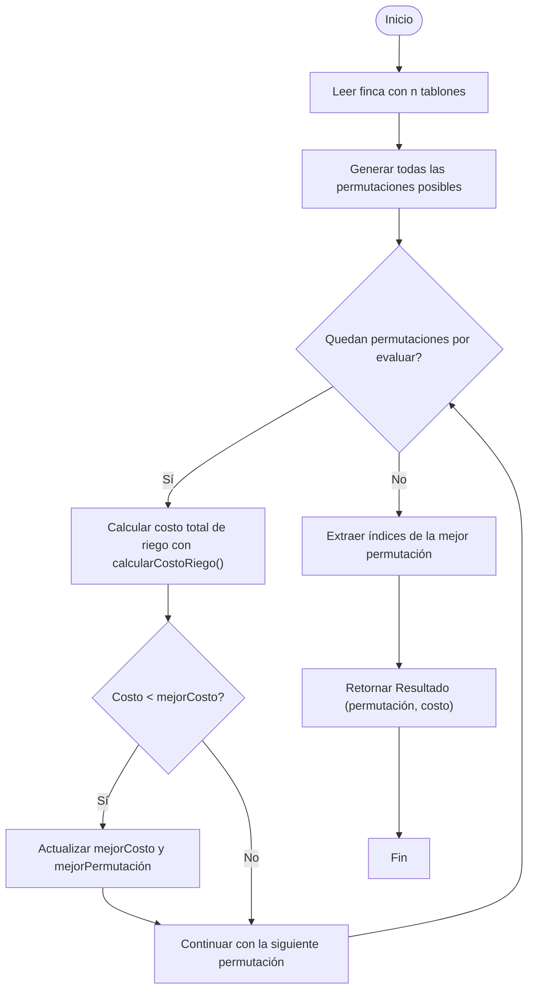

# Solución: Fuerza Bruta para Riego Óptimo de Tablones

## Estrategia general

El algoritmo de fuerza bruta explora todas las permutaciones posibles del orden en que se riegan los tablones de una finca. Para cada orden se calcula el costo total de riego y se selecciona la permutación con el menor costo. Es simple y garantiza la solución óptima, aunque es exponencial en el número de tablones.

---

## Estructura del problema

Una finca se representa como una secuencia de tablones:

$$
F = \langle T_0, T_1, T_2, \dots, T_{n-1} \rangle
$$

Cada tablón \(T_i\) tiene tres atributos:

| Campo | Símbolo | Descripción |
|---|---:|---|
| Tiempo de supervivencia | \($ts_i$\) | Días que puede aguantar sin riego |
| Tiempo de riego | \($tr_i$\) | Días que tarda en regarse |
| Prioridad | \($p_i$\) | Entero 1..4 que pondera el costo |

---

## Definición matemática

El objetivo es minimizar el costo total de riego \($CRF_{\Pi}$\) dado un orden de riego \($\Pi$\).

# Solución: Fuerza Bruta para Riego Óptimo de Tablones

## Estrategia general

El algoritmo de fuerza bruta explora todas las permutaciones posibles del orden en que se riegan los tablones de una finca. Para cada orden se calcula el costo total de riego y se selecciona la permutación con el menor costo. Es simple y garantiza la solución óptima, aunque es exponencial en el número de tablones.

---

## Estructura del problema

Una finca se representa como una secuencia de tablones:

$$
F = \langle T_0, T_1, T_2, \dots, T_{n-1} \rangle
$$

Cada tablón \(T_i\) tiene tres atributos:

| Campo | Símbolo | Descripción |
|---|---:|---|
| Tiempo de supervivencia | \($ts_i$\) | Días que puede aguantar sin riego |
| Tiempo de riego | \($tr_i$\) | Días que tarda en regarse |
| Prioridad | \($p_i$\) | Entero 1..4 que pondera el costo |

---

## Definición matemática

El objetivo es minimizar el costo total de riego \($CRF_{\Pi}$\) dado un orden de riego \($\Pi$\).

### 1) Tiempo de inicio de cada tablón
$$
t_{\Pi}(i) =
\begin{cases}
0, & \text{si } i = 0 \\\
_{\Pi}(i-1) + tr_{\Pi(i-1)}, & \text{si } i > 0
\end{cases}
$$

### 2) Costo individual de un tablón
$$
CRF_{\Pi}[i] = p_i \times \max\big(0, (t_{\Pi}(i) + tr_i) - ts_i\big)
$$

### 3) Costo total del orden
$$
CRF_{\Pi} = \sum_{i=0}^{n-1} CRF_{\Pi}[i]
$$

La solución óptima es
$$
\Pi^* = \underset{\Pi}{\operatorname{argmin}}\; CRF_{\Pi}
$$

---

## Notas y mejoras posibles

- Esta implementación asume que `finca.calcularCostoRiego` acepta la permutación en el formato usado arriba. Si el proyecto usa índices en lugar de listas de atributos, conviene adaptar `generarPermutaciones` para devolver listas de índices.
- La fuerza bruta es práctica solo para n pequeños (n <= 10..11). Para n mayor, considerar heurísticas o algoritmos exactos más eficientes (p. ej. branch-and-bound).

---

### Diagrama de flujo (Mermaid)

## Complejidad

| Tipo | Descripción | Complejidad |
|---|---|---:|
| Tiempo | Se generan todas las permutaciones posibles de tamaño n!, y se evalúan una por una. | O(n × n!) |
| Espacio | Se almacenan todas las permutaciones generadas. | O(n × n!) |

➡️ Conclusión: Inviable para n > 10. El algoritmo crece factorialmente y solo es útil para pruebas pequeñas o comparación con métodos más eficientes.

## Ejemplo

Entrada:

n = 5
(10, 3, 4)
(5, 3, 3)
(2, 2, 1)
(8, 1, 1)
(6, 4, 2)

Salida esperada:

Costo mínimo: 15
Permutación óptima: [2, 1, 4, 3, 0]

## Resumen de Complejidad

| Función / Método | Complejidad Temporal | Complejidad Espacial |
|---|---:|---:|
| generarPermutaciones() | O(n!) | O(n!) |
| resolver() | O(n × n!) | O(n) |
| calcularCostoRiego() | O(n) | O(1) |
| Total del algoritmo | O(n × n!) | O(n!) |

