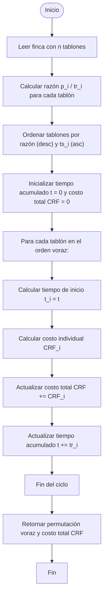

# Solución: Voraz para Riego Óptimo de Tablones

## ⚙️ Estrategia general

El **algoritmo voraz** selecciona el orden de riego priorizando los tablones con **mayor relación entre prioridad y tiempo de riego**, definida por la siguiente expresión:

$$
\frac{p_i}{tr_i}
$$

donde:
- \( p_i \) es la prioridad del tablón \( i \),
- \( tr_i \) es el tiempo necesario para regarlo.

En cada paso, se elige el tablón disponible con el **mayor valor de** $$ \frac{p_i}{tr_i} $$ **y que no haya superado su tiempo de supervivencia** \($ts_i$).

El tiempo de inicio para cada tablón dentro de la secuencia óptima \($\Pi$\) se calcula de forma acumulativa:

$$
t_{\Pi[j]} = t_{\Pi[j-1]} + tr_{\Pi[j-1]}, \quad j = 1, \ldots, n-1
$$

Este método **busca minimizar el costo total de riego** mediante decisiones locales eficientes.  
Aunque no siempre garantiza la solución óptima, logra resultados cercanos con una **complejidad temporal** de:

$$
O(n \log n)
$$

---
## 🧩 Estructura del problema

La indica por el enunciado del problema.

--- 
## ⚙️ Definición formal del método voraz

### 1. Permutación voraz

La **permutación voraz** $\ Pi_{\text{voraz}} $ se obtiene ordenando los índices$\ i $ de los tablones
según la razón $\ dfrac{p_i}{tr_i} $ en **orden descendente**.  
En caso de empate, se prioriza el tablón con **menor tiempo de supervivencia** $\ ts_i $

$$
\Pi_{\mathrm{voraz}} =
\operatorname{sort\_indices}\!\left(\frac{p_i}{tr_i}\right)_{\text{desc}},
\quad \text{desempate: } {ts_i}_{\text{asc}}
$$

---

### ⏱️ Tiempo de inicio en la secuencia voraz

El tiempo de inicio del riego para el tablón en la posición $\ i $ dentro de la permutación voraz es:

$$
t_{\Pi_{\text{voraz}}}(0) = 0,
\qquad
t_{\Pi_{\text{voraz}}}(i) = t_{\Pi_{\text{voraz}}}(i-1) + tr_{\Pi_{\text{voraz}}(i-1)},
\quad (i > 0)
$$

---

### 💧 Costo individual por tablón

El **costo de riego** para el tablón ubicado en la posición \( i \) de la secuencia voraz se define como:

$$
CRF_{\Pi_{\text{voraz}}}[i] =
p_{\Pi_{\text{voraz}}(i)} \times
\max\!\Big(0,\;
t_{\Pi_{\text{voraz}}}(i) + tr_{\Pi_{\text{voraz}}(i)} - ts_{\Pi_{\text{voraz}}(i)}\Big)
$$

---

### 💰 Costo total de la estrategia voraz

El costo total acumulado de la finca bajo la estrategia voraz es:

$$
CRF_{\Pi_{\text{voraz}}} =
\sum_{i=0}^{n-1} CRF_{\Pi_{\text{voraz}}}[i]
$$

---

### 📊 Propiedades del método

- **Complejidad temporal:** $\ O(n \log n) $ — debido al proceso de ordenamiento inicial.
- **Complejidad espacial:** $\ O(n) $.
- **Optimalidad:** No garantiza la solución óptima global, ya que las decisiones son locales (heurística rápida).

---

## 🧩 Notas y mejoras posibles

### Optimización del ordenamiento
> **Nota:** Implementar algoritmos de ordenamiento más eficientes o estructuras de datos especializadas para mejorar el rendimiento en casos específicos.
 
El ordenamiento usado en la estrategia voraz $\ O(n \log n) $ ya es eficiente para la mayoría de los casos.  
Sin embargo, podrían considerarse optimizaciones como:
- **Ordenamientos parciales** (*partial sort*) si solo se necesita el subconjunto de mayor prioridad.
- Uso de una **cola de prioridad (heap)** para seleccionar el siguiente tablón sin ordenar toda la lista.
- Aplicar **comparadores compuestos** optimizados para evitar cálculos repetidos de $\frac{p_i}{tr_i} $.
- En casos con grandes volúmenes de datos, se podría evaluar la paralelización del ordenamiento o su ejecución en **streams concurrentes** (en Java, usando `parallelStream()`).

Estas optimizaciones no cambian la complejidad asintótica, pero sí pueden **reducir el tiempo real de ejecución** y mejorar la **escalabilidad** del algoritmo en fincas con miles de tablones.

### Diagrama de flujo (Mermaid)

---
### 📊 Resumen de la complejidad

| Tipo      | Descripción                                                      |      Complejidad |
|------------|------------------------------------------------------------------|-----------------:|
| **Tiempo** | Ordenamiento de los tablones según la razón $ \frac{p_i}{tr_i} $ | $\ O(n \log n) $ |
| **Espacio** | Almacenamiento de la permutación y de variables auxiliares       |        $\ O(n) $ |

---

En conclusión, el **algoritmo voraz** representa una solución **eficiente y práctica** para el problema del riego de tablones.  
Aunque no garantiza la obtención de la solución óptima global, ofrece un **buen equilibrio entre rendimiento y calidad del resultado**, siendo especialmente útil en escenarios reales donde el número de tablones es grande y se requiere una respuesta rápida.
